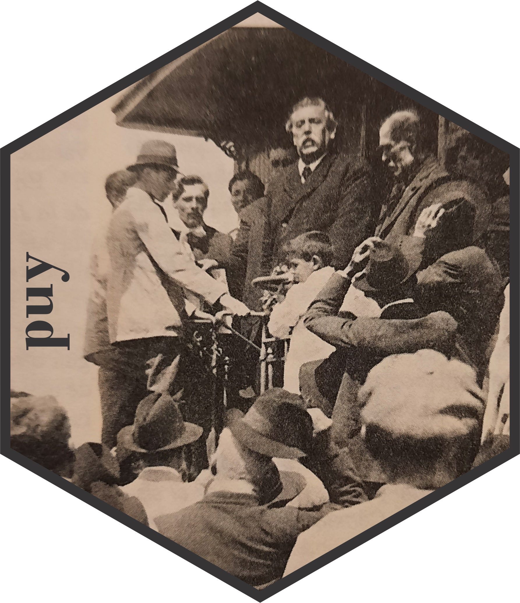

<!-- README.md is generated from README.Rmd. Please edit that file -->

```{r, include = FALSE}
knitr::opts_chunk$set(
  collapse = TRUE,
  comment = "#>",
  fig.path = "man/figures/README-",
  out.width = "100%"
)
```

## `puy`: políticos uruguayos 


*Nicolás Schmidt, Antonio Cardarello, Alfonso Castiglia, Fabricio Carneiro, Diego Luján, Felipe Monestier UMAD<sup><a id="fnr.1" class="footref" href="#fn.1">1</a></sup>.*

<!-- badges: start -->

[](https://CRAN.R-project.org/package=puy)
[](https://www.repostatus.org/#active)
[](https://lifecycle.r-lib.org/articles/stages.html)
`r badger::badge_devel("Nicolas-Schmidt/puy", "orange")`
[](https://github.com/Nicolas-Schmidt/puy/actions)
<!-- badges: end -->

### Descripción

Contiene un conjunto de datos original de políticos uruguayos que ocuparon diversos cargos públicos: Presidentes, Ministros, Senadores, Diputados, Alcaldes, Concejales Municipales, Ministros de Corte Electoral entre otros. Esta base de datos permite seguir la trayectoria de un político a lo largo de su carrera y los distintos cargos que fue ocupando. Asimismo, es de gran utilidad para tener la identificación partidaria de los políticos en el tiempo para poder empalmar con otros conjuntos de datos en donde la unidad de análisis sea el político. El ejemplo inmediato de esto ultimo es la base de datos que se genera a partir de los diarios de sesión del parlamento con el paquete [`speech()`](https://nicolas-schmidt.github.io/speech/).

El manual del paquete se puede encontrar [__aquí__](https://github.com/Nicolas-Schmidt/puy/blob/master/man/figures/Manual_puy.pdf).


> La foto del logo es José Batlle y Ordóñez hablando desde la plataforma del vagón de un tren durante una gira política en el departamento de Treinta y Tres en 1919<sup><a id="fnr.2" class="footref" href="#fn.2">2</a></sup>.

## Contenido del paquete


#### Conjuntos de datos


##### `politicos`

| Variable          | Descripción                                                                                |
| ----------------- | ------------------------------------------------------------------------------------------ |
| `politico`        | Partido al que pertenece el político en el cargo.                                          |
| `partido`         | Partido al que pertenece el político en el cargo.                                          |
| `fecha_inicio`    | Fecha de inicio en el que comienza la gestión en el cargo.                                 |
| `fecha_inicio`    | Fecha de fin en la que finaliza la gestión en el cargo.                                    |
| `legislatura`     | Legislatura en la que ocupa el cargo el político. Esta variable es para los cargos que tienen secuencia legislativa (Legisladores, Ministros, Precidente, Vicepresidente...).   | 
| `cargo`           | Tipo de cargo.                                                                             |
| `status`          | Si es Titular, Suplente, Nominal...                                                        |
| `circunscripcion` | Distrito al que pertenece el legislador (esto aplica a los Diputados).                     |
| `sexo`            | Sexo.                                                                                      |


Actualmente la base cuenta con la siguiente informacion:

| Políticos                     | Periodo       |
| ------------------------------| ------------- |
| Presidentes y Vicepresidentes | 1830 - 2020   |
| Legisladores                  | 1830 - 2020   |
| Ministros de Estado           | 1904 - 2020   |
| Alcaldes y Concejales         | 2010 - 2020   |
| Ministros Corte Electoral     | 1985 - 2020   |


##### `legislaturas`

| Variable    | Descripción                                            |
| ----------- | ------------------------------------------------------ |
| `legislatura` | Número de la legislatura.                            |
| `inicio`      | Fecha de inicio de la legislatura.                   |
| `fin`         | Fecha de cierre de la legislatura                    |
| `dias`        | Cantidad de días que estuvo abierta la legislatura.  |
| `periodo`     | Años de la legislatura, ejemplo: 2005-2010           |


#### Funciones

| Función        | Descripción                                          |
| -------------- | ---------------------------------------------------- |
| `politico()`   | Permite buscar políticos en la base `puy::politicos`.|
| `add_party()`  | Permite agregar la etiqueta partidaria de cada legislador a un diario de sesión en el formato que devuelve la función [`speech_build()`](https://nicolas-schmidt.github.io/speech/reference/speech_build.html) del paquete de R [`speech()`](https://nicolas-schmidt.github.io/speech/).|


## Ejemplos


```{r}
library(puy)

politico(nombre = "Mujica")

politico(nombre = "Mujica Cordano")

politico("roballo")

## ~~~~~~~~~~~~~~~~~~~~~~~~~~~~~~~~~~~~~~~~~~~~~~~~~~~~~~~~~~~~~~~~~~~~~~~
# Legisladores que tienen apellido iniciado por la letra 'W'
## ~~~~~~~~~~~~~~~~~~~~~~~~~~~~~~~~~~~~~~~~~~~~~~~~~~~~~~~~~~~~~~~~~~~~~~~
legis_W <- politico(nombre = "W")


## ~~~~~~~~~~~~~~~~~~~~~~~~~~~~~~~~~~~~~~~~~~~~~~~~~~~~~~~~~~~~~~~~~~~~~~~
# legisladores que tienen la expresion lacalle en alguna parte del nombre
## ~~~~~~~~~~~~~~~~~~~~~~~~~~~~~~~~~~~~~~~~~~~~~~~~~~~~~~~~~~~~~~~~~~~~~~~
lacalle <- politico(nombre = "lacalle", contiene = TRUE)


```

##### Ejemplo con `speech::speech_build()`

```{r}
library(speech)

url <- "http://bit.ly/35AUVF4"
text1 <- speech::speech_build(file = url, compiler = TRUE)
text1

floor_speech <- add_party(speech = text1)

dplyr::glimpse(floor_speech)

floor_speech[c(1,2,7:12)]

## ~~~~~~~~~~~~~~~~~~~~~~~~~~~~~~
## Diario de sesión NO compilado
## ~~~~~~~~~~~~~~~~~~~~~~~~~~~~~~

url %>% 
  speech::speech_build() %>% 
  puy::add_party() %>% 
  subset(select = c(1,2,7:12)) %>% # se seleccionan variables que se agregan con add_party()
  print(n = Inf)


```

```{r, echo = F, message=FALSE}
library(tidyverse)
```

##### Exploración de base de datos `puy::politicos`

¿Cuántas mujeres ocuparon cargos políticos?

```{r}
politicos %>% 
    select(politico, legislatura, cargo, sexo) %>% 
    unique() %>% 
    mutate(cargo = ifelse(str_detect(cargo, "^Ministro"), "Ministro", cargo)) %>%
    group_by(cargo) %>% 
    summarise(Hombres = sum(sexo), 
              Mujeres = n() - sum(sexo),
              Prop_mujeres = paste0(round(Mujeres / n() *100), "%")) %>% 
    print(n = Inf)
```

¿En qué legislatura las mujeres ocuparon más cargos legislativos?

```{r, fig.width=12, fig.height=4}
legis_mujeres <- 
    politicos %>% 
    filter(cargo %in% c("Diputados", "Senado")) %>% 
    select(politico, cargo, legislatura, sexo) %>% 
    distinct() %>% 
    group_by(legislatura) %>% 
    summarise(Hombres = round(sum(sexo)/length(sexo) * 100), 
              Mujeres = round(100 - Hombres)) %>% 
    merge(., legislaturas[, c("legislatura", "periodo")], by = "legislatura") %>% 
    select(4,2,3) %>% 
    pivot_longer(cols = 2:3, names_to = "Sexo", values_to = "Porcentaje")


ggplot(data = legis_mujeres, aes(x = periodo , y = Porcentaje, fill = Sexo)) + 
    geom_bar(stat = "identity") +
    scale_fill_manual(values = c("#FDDDA0", "purple")) +
    theme_minimal() +
    guides(x = guide_axis(angle = 60)) +
    labs(x = "", y = "")


```


```{r, echo = FALSE, message = FALSE}
manual <- function(){
    old <- here::here()
    path <- here::here('man', 'figures')
    sink('noise.txt')
    devtools::build_manual(path = path)
    sink()
    setwd(path)
    invisible(file.rename(list.files(pattern="^puy"), 'Manual_puy.pdf'))
    setwd(old)
    invisible(file.remove('noise.txt'))
}
manual()
```


#### Notas

---
<sup><a id="fn.1" href="#fnr.1">1</a></sup> Unidad de Métodos y Acceso a Datos, Facultad de Ciencias Sociales, Universidad de la República (UMAD-FCS-UdelaR)

<sup><a id="fn.2" href="#fnr.2">2</a></sup> Foto extraida de _"Crónica General del Uruguay"_, Washington Reyes Abadie, Andrés Vázquez Romero, Banda Oriental, Montevideo, Uruguay, 2000, p.399. La diagramación del logo es obra de Nadia Repetto (narepetto@gmail.com)


