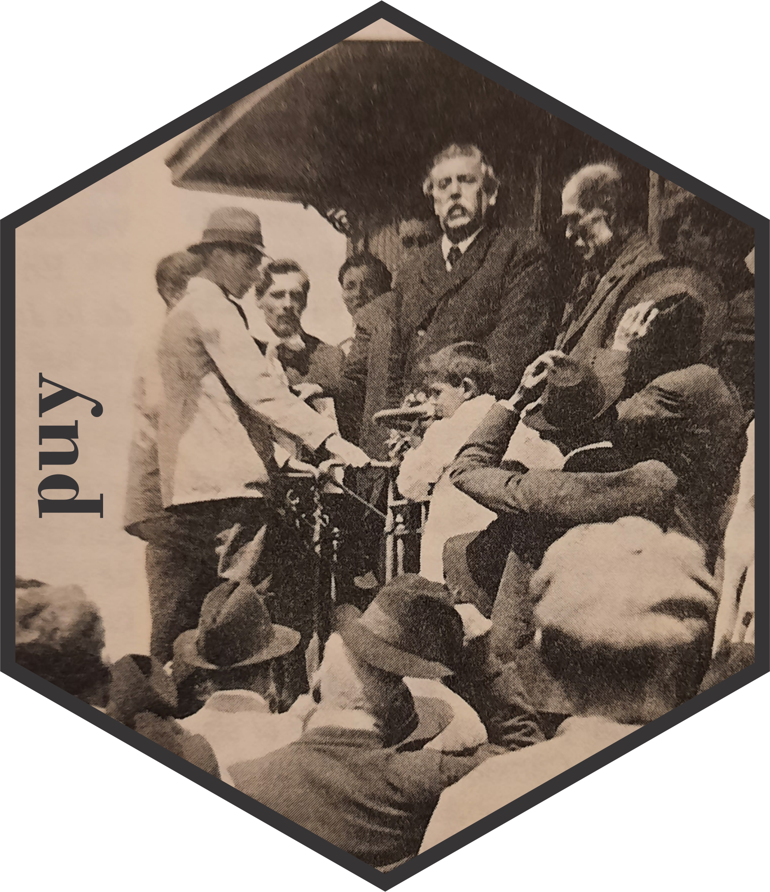

<!-- README.md is generated from README.Rmd. Please edit that file -->

## `puy`: políticos uruguayos 

*Nicolás Schmidt, Antonio Cardarello, Alfonso Castiglia, Fabricio
Carneiro, Diego Luján, Felipe Monestier
UMAD<sup><a id="fnr.1" class="footref" href="#fn.1">1</a></sup>.*

<!-- badges: start -->

[](https://CRAN.R-project.org/package=puy)
[](https://www.repostatus.org/#active)
[](https://lifecycle.r-lib.org/articles/stages.html)
[](https://github.com/Nicolas-Schmidt/puy)
[](https://github.com/Nicolas-Schmidt/puy/actions)
<!-- badges: end -->

### Descripción

Contiene un conjunto de datos original de politicos uruguayos que
ocuparon diversos cargos publicos: Presidentes, ministros, legisladores,
alcaldes, concejales, ministros de corte electoral. Esta base de datos
permite seguir la trayectoria de un politico a lo largo de su carrera y
los distintos cargos que fue ocupando. Asimismo, es de gran utilidad
para tener la identificacion partidaria de los politicos en el tiempo
para poder empalmar con otros conjuntos de datos en donde la unidad es
el politico. El ejemplo inmediato de esto ultimo es la base de datos que
se genera a partir de los diarios de sesion del parlamento con el
paquete speech.

#### Conjuntos de datos

### `politicos`

| Variable          | Descripción                                                                              |
| ----------------- | ---------------------------------------------------------------------------------------- |
| `politico`        | Partido al que pertenece el politico en el cargo.                                        |
| `partido`         | Partido al que pertenece el politico en el cargo.                                        |
| `fecha_inicio`    | Fecha de inicio en el que comienza la gestión en el cargo.                               |
| `fecha_inicio`    | Fecha de fin en la que finaliza la gestión en el cargo.                                  |
| `legislatura`     | Legislatura en la que ocupa el cargo. Esta variable es para los legisladores unicamente. |
| `cargo`           | Tipo de cargo.                                                                           |
| `status`          | Si es Titula, Suplente, Nominal…                                                         |
| `circunscripcion` | Distrito al que pertenece el legislador.                                                 |
| `sexo`            | Sexo.                                                                                    |

Actualmente la base cuenta con la siguiente informacion:

| Políticos                     | Periodo     |
| ----------------------------- | ----------- |
| Presidentes y Vicepresidentes | 1830 - 2020 |
| Legisladores                  | 1830 - 2020 |
| Ministros de Estado           | 1904 - 2020 |
| Alcaldes y Concejales         | 2010 - 2020 |
| Ministros Corte Electoral     | 1985 - 2020 |

### `legislaturas`

| Variable      | Descripción                                         |
| ------------- | --------------------------------------------------- |
| `legislatura` | Número de la legislatura.                           |
| `inicio`      | Fecha de inicio de la legislatura.                  |
| `fin`         | Fecha de cierre de la legislatura                   |
| `dias`        | Cantidad de días que estuvo abierta la legislatura. |

#### Funciones

| Función       | Descripción                                                                                                                                                         |
| ------------- | ------------------------------------------------------------------------------------------------------------------------------------------------------------------- |
| `add_party()` | Permite agregar la etiqueta partidaria de cada legislador a un diario de sesion en el formato que devuelve la función `speech_build()` del paquete de R `speech()`. |

## Ejemplo

``` r
library(speech)
library(puy)
url <- "http://bit.ly/35AUVF4"
text1 <- speech::speech_build(file = url, compiler = TRUE)
text1
#> # A tibble: 11 x 7
#>    legislator legislature chamber    date       id    speech                 sex
#>    <chr>            <dbl> <chr>      <date>     <chr> <chr>                <dbl>
#>  1 ABDALA              48 COMISION ~ NA         35AU~ SEÑOR ABDALA. Voto ~     1
#>  2 ASTI                48 COMISION ~ NA         35AU~ SEÑOR ASTI. Obviame~     1
#>  3 AVIAGA              48 COMISION ~ NA         35AU~ SEÑORA AVIAGA. Pido~     0
#>  4 BORDABERRY          48 COMISION ~ NA         35AU~ SEÑOR BORDABERRY. P~     1
#>  5 GOÑI                48 COMISION ~ NA         35AU~ SEÑOR GOÑI. Pido la~     1
#>  6 LAZO                48 COMISION ~ NA         35AU~ SEÑORA LAZO. Voto p~     0
#>  7 MAHIA               48 COMISION ~ NA         35AU~ SEÑOR MAHIA. Pido l~     1
#>  8 MERONI              48 COMISION ~ NA         35AU~ SEÑOR MERONI. Voto,~     1
#>  9 PEREYRA             48 COMISION ~ NA         35AU~ SEÑORA PEREYRA. Con~     0
#> 10 TOURNE              48 COMISION ~ NA         35AU~ SEÑORA TOURNE. Voy ~     0
#> 11 VIERA               48 COMISION ~ NA         35AU~ SEÑOR VIERA. Voto p~     1

floor_speech <- add_party(speech = text1)

dplyr::glimpse(floor_speech)
#> Rows: 11
#> Columns: 12
#> $ legislator  <chr> "ABDALA", "ASTI", "AVIAGA", "BORDABERRY", "GOÑI", "LAZO", ~
#> $ legislature <dbl> 48, 48, 48, 48, 48, 48, 48, 48, 48, 48, 48
#> $ chamber     <chr> "COMISION PERMANENTE", "COMISION PERMANENTE", "COMISION PE~
#> $ date        <date> NA, NA, NA, NA, NA, NA, NA, NA, NA, NA, NA
#> $ id          <chr> "35AUVF4", "35AUVF4", "35AUVF4", "35AUVF4", "35AUVF4", "35~
#> $ speech      <chr> "SEÑOR ABDALA. Voto por la señora legisladora Daisy Tourn~
#> $ sex         <dbl> 1, 1, 0, 1, 1, 0, 1, 1, 0, 0, 1
#> $ legislator2 <chr> "ABDALA, Pablo", "ASTI, Alfredo", "AVIAGA, Carol", "BORDAB~
#> $ party       <chr> "Partido Nacional", "Frente Amplio", "Partido Nacional", "~
#> $ party_acron <chr> "PN", "FA", "PN", "PC", "PN", "FA", "FA", NA, "FA", "FA", ~
#> $ indicator   <int> 1, 1, 1, 1, 2, 3, 1, NA, 1, 1, 1
#> $ words       <int> 400, 46, 107, 963, 100, 103, 128, 12, 12, 111, 8

floor_speech[c(1,2,7:12)]
#> # A tibble: 11 x 8
#>    legislator legislature   sex legislator2   party  party_acron indicator words
#>    <chr>            <dbl> <dbl> <chr>         <chr>  <chr>           <int> <int>
#>  1 ABDALA              48     1 ABDALA, Pablo Parti~ PN                  1   400
#>  2 ASTI                48     1 ASTI, Alfredo Frent~ FA                  1    46
#>  3 AVIAGA              48     0 AVIAGA, Carol Parti~ PN                  1   107
#>  4 BORDABERRY          48     1 BORDABERRY, ~ Parti~ PC                  1   963
#>  5 GOÑI                48     1 GOÑI ROMERO,~ Parti~ PN                  2   100
#>  6 LAZO                48     0 LAZO, Sandra  Frent~ FA                  3   103
#>  7 MAHIA               48     1 MAHIA, Jose ~ Frent~ FA                  1   128
#>  8 MERONI              48     1 <NA>          <NA>   <NA>               NA    12
#>  9 PEREYRA             48     0 PEREYRA, Sus~ Frent~ FA                  1    12
#> 10 TOURNE              48     0 TOURNE, Daisy Frent~ FA                  1   111
#> 11 VIERA               48     1 VIERA, Tabare Parti~ PC                  1     8


## Diario de sesión NO compilado

text2 <- "http://bit.ly/35AUVF4" %>% 
    speech::speech_build() %>% 
    add_party() %>% 
    #.[c(1,2,7:12)] %>% 
    print(n = Inf)
#> # A tibble: 24 x 12
#>    legislator legislature chamber  date       id     speech      sex legislator2
#>    <chr>            <dbl> <chr>    <date>     <chr>  <chr>     <dbl> <chr>      
#>  1 ABDALA              48 COMISIO~ 2019-09-17 35AUV~ SEÑOR AB~     1 ABDALA, Pa~
#>  2 ABDALA              48 COMISIO~ 2019-09-17 35AUV~ SEÑOR AB~     1 ABDALA, Pa~
#>  3 ABDALA              48 COMISIO~ 2019-09-17 35AUV~ SEÑOR AB~     1 ABDALA, Pa~
#>  4 ASTI                48 COMISIO~ 2019-09-17 35AUV~ SEÑOR AS~     1 ASTI, Alfr~
#>  5 AVIAGA              48 COMISIO~ 2019-09-17 35AUV~ SEÑORA A~     0 AVIAGA, Ca~
#>  6 AVIAGA              48 COMISIO~ 2019-09-17 35AUV~ SEÑORA A~     0 AVIAGA, Ca~
#>  7 AVIAGA              48 COMISIO~ 2019-09-17 35AUV~ SEÑORA A~     0 AVIAGA, Ca~
#>  8 BORDABERRY          48 COMISIO~ 2019-09-17 35AUV~ SEÑOR BO~     1 BORDABERRY~
#>  9 BORDABERRY          48 COMISIO~ 2019-09-17 35AUV~ SEÑOR BO~     1 BORDABERRY~
#> 10 BORDABERRY          48 COMISIO~ 2019-09-17 35AUV~ SEÑOR BO~     1 BORDABERRY~
#> 11 BORDABERRY          48 COMISIO~ 2019-09-17 35AUV~ SEÑOR BO~     1 BORDABERRY~
#> 12 BORDABERRY          48 COMISIO~ 2019-09-17 35AUV~ SEÑOR BO~     1 BORDABERRY~
#> 13 BORDABERRY          48 COMISIO~ 2019-09-17 35AUV~ SEÑOR BO~     1 BORDABERRY~
#> 14 GOÑI                48 COMISIO~ 2019-09-17 35AUV~ SEÑOR GO~     1 GOÑI ROMER~
#> 15 GOÑI                48 COMISIO~ 2019-09-17 35AUV~ SEÑOR GO~     1 GOÑI ROMER~
#> 16 GOÑI                48 COMISIO~ 2019-09-17 35AUV~ SEÑOR GO~     1 GOÑI ROMER~
#> 17 LAZO                48 COMISIO~ 2019-09-17 35AUV~ SEÑORA L~     0 LAZO, Sand~
#> 18 MAHIA               48 COMISIO~ 2019-09-17 35AUV~ SEÑOR MA~     1 MAHIA, Jos~
#> 19 MAHIA               48 COMISIO~ 2019-09-17 35AUV~ SEÑOR MA~     1 MAHIA, Jos~
#> 20 MAHIA               48 COMISIO~ 2019-09-17 35AUV~ SEÑOR MA~     1 MAHIA, Jos~
#> 21 MERONI              48 COMISIO~ 2019-09-17 35AUV~ SEÑOR ME~     1 <NA>       
#> 22 PEREYRA             48 COMISIO~ 2019-09-17 35AUV~ SEÑORA P~     0 PEREYRA, S~
#> 23 TOURNE              48 COMISIO~ 2019-09-17 35AUV~ SEÑORA T~     0 TOURNE, Da~
#> 24 VIERA               48 COMISIO~ 2019-09-17 35AUV~ SEÑOR VI~     1 VIERA, Tab~
#> # ... with 4 more variables: party <chr>, party_acron <chr>, indicator <int>,
#> #   words <int>
```

#### Notas

-----

<sup><a id="fn.1" href="#fnr.1">1</a></sup> Unidad de Métodos y Acceso a
Datos, Facultad de Ciencias Sociales, Universidad de la República
(UMAD-FCS-UdelaR)
